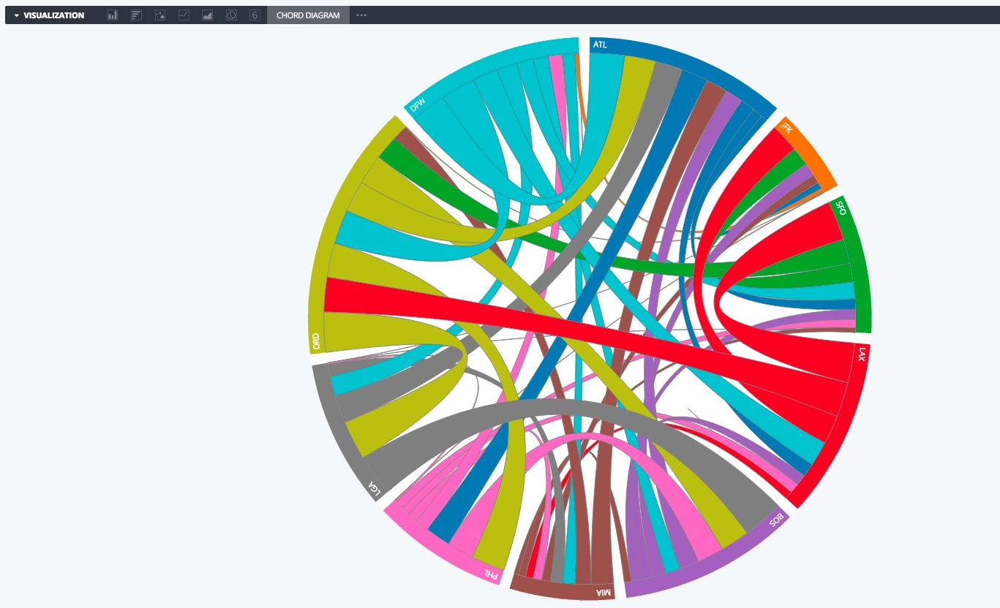

<table>
    <tr valign="top">
        <td width="25%">
        	<a href="hello_world/hello_world.js">
        	Hello World 
        	</a>
        </td>
        <td width="25%">
        	<a href="chord">
        	Chord 
        	</a>
        </td>
    </tr>
     <tr valign="top">
       <td width="25%">
        	<a href="single_value_panes/single_value_pane.js">
        	Single Value Pane 
        	</a>
        </td>
        <td width="25%">
        	<a href="devices/devices.js">
        	Devices 
        	</a>
        </td>
    </tr>
     <tr valign="top">
       <td width="25%">
        	<a href="stopwatch/stopwatch.js">
        	Stopwatch 
        	</a>
        </td>
    </tr>
</table>
